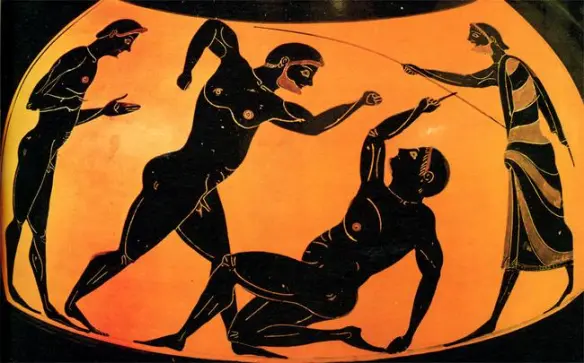

# Historia Antigua de los Juegos Olímpicos

Los primeros Juegos Olímpicos se celebraron en Olimpia, Grecia, en el año 776 a.C. Fueron dedicados a Zeus y se realizaban cada cuatro años.

## Video: Historia de los Juegos Olímpicos Antiguos

Aquí puedes ver un video corto que describe la historia de los Juegos Olímpicos en la Antigua Grecia.

🔍 **Dato Curioso:** Los Juegos Olímpicos fueron prohibidos en el año 393 d.C. por el emperador Teodosio I, debido a que consideraba los juegos como un vestigio pagano.

[Regresar a la historia de los Juegos Olímpicos](README.md)
